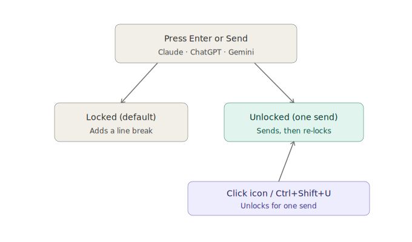

<p align="center">
  
</p>

# Send Guard

 

English | [日本語](./README.md)

A Chrome/Edge extension that prevents accidental sends in AI chats (Claude / ChatGPT / Gemini) — no more half-written messages sent by a stray Enter key or misclick.

## Screenshots

| Locked | Unlocked |
|---|---|
|  |  |

## Status

✅ Published — [live on GitHub](https://github.com/Maximiliana65/send-guard) (verified on Claude / ChatGPT / Gemini, on Chrome and Edge, in both regular and private/incognito windows)

See [ROADMAP.md](./ROADMAP.md) for what's planned, [CHANGELOG.md](./CHANGELOG.md) for release history, [DEVLOG.md](./DEVLOG.md) for the development journal, and [docs/DESIGN.md](./docs/DESIGN.md) for the original design notes.

## What it does



- **Enter always inserts a line break** — your message is never sent by accident
- When you actually want to send, click the 🔒 badge in the corner (or press `Ctrl+Shift+U`) to unlock
  - The unlock is good for **exactly one send**, then it automatically re-locks
  - Press `Esc` to cancel the unlock without sending
- Send and "Regenerate/Retry" buttons are protected the same way
- (Optional) A small, playful comment can appear after each send — off by default

## Installation (developer mode)

**Chrome**
1. Download and unzip this folder
2. Open `chrome://extensions`
3. Turn on "Developer mode" (top right)
4. Click "Load unpacked" and select this folder
5. Open `https://claude.ai` — if you see the lock badge in the bottom right, you're set

**Edge**
Same steps, but at `edge://extensions`. Edge is Chromium-based, so it works the same way.

## Folder structure

```
core/       … shared lock logic, independent of any specific site
            … *-page-guard.js files run in the page's own MAIN world
              (ChatGPT and Gemini only — see DEVLOG for why)
adapters/   … per-site definitions of "where's the input box / send button"
fun/        … the optional fun-comment feature (comments.ja.js / comments.en.js
              are picked automatically based on the browser's UI language)
popup/      … the settings screen opened from the toolbar icon
_locales/   … UI strings for i18n (currently Japanese and English)
icons/      … toolbar icon (a simple lock, chosen for legibility at small sizes)
docs/       … design notes, screenshots, brand assets
```

Adding support for another AI service is meant to be as simple as adding one new file under `adapters/` and adding the site to `manifest.json`.

## Versioning

This project follows [Semantic Versioning](https://semver.org/) (`MAJOR.MINOR.PATCH`) and tags each release in Git (e.g. `v0.5.3`).

<details>
<summary>Maintainer notes: tagging releases</summary>

- New backward-compatible feature → bump MINOR (e.g. `0.1.0` → `0.2.0`)
- Bug fix only → bump PATCH (e.g. `0.2.0` → `0.2.1`)
- Breaking change → bump MAJOR
- Each release gets a Git tag

To push tags to GitHub:

```
git push origin main --tags
```

</details>

## Supported / Not supported

**Supported**
- Claude (Web / claude.ai)
- ChatGPT (Web / chatgpt.com)
- Gemini (Web / the main gemini.google.com page)

**Not currently supported**
- Chrome's built-in "Gemini side panel" feature — this is a native Chrome browser
  feature rather than a regular web page, so it works differently under the hood
  and isn't supported at this time.

## Limitations

- This extension is an **assistive tool** to help reduce accidental sends. It cannot guarantee prevention in every situation.
- Changes to the user interface of the supported AI services (Claude / ChatGPT / Gemini) may temporarily affect compatibility until the extension is updated.
- Please review important messages before sending.
- This software is provided "AS IS" under the [MIT License](./LICENSE), without warranty of any kind.

## License

[MIT License](./LICENSE) — free to modify, redistribute, and use commercially. Just keep the copyright notice.
