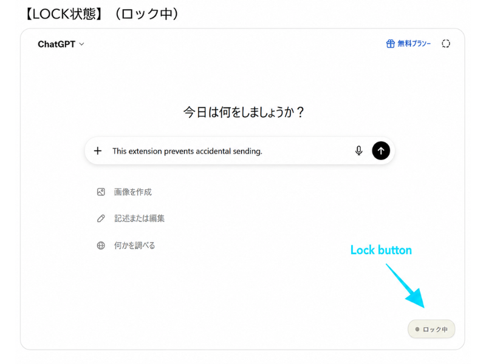
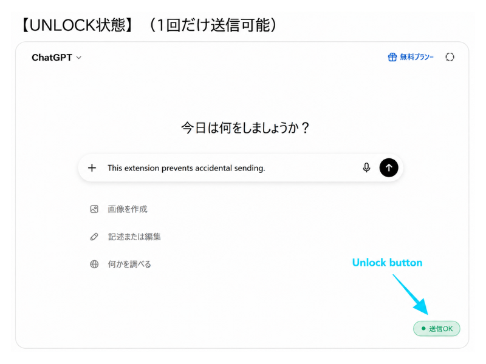
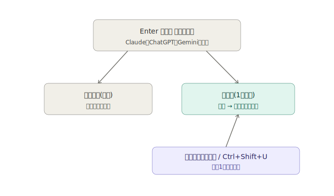

<p align="center">
  
</p>

# Send Guard（送信ロック）

 

**日本語** | [English](./README.en.md)

AIチャット(Claude / ChatGPT / Gemini)で、うっかりEnterキーや送信・再試行ボタンを
押してしまい、書きかけのメッセージを送ってしまう事故を防ぐためのChrome/Edge拡張機能です。

## スクリーンショット

| ロック中 | ロック解除中 |
|---|---|
|  |  |

## 現在のステータス

✅ 公開済み — [GitHubで公開中](https://github.com/Maximiliana65/send-guard)（Claude / ChatGPT / Gemini、Chrome・Edgeの通常/シークレットモードで動作確認済み）

対応予定は [ROADMAP.md](./ROADMAP.md) を、変更履歴は [CHANGELOG.md](./CHANGELOG.md) を、
開発の過程は [DEVLOG.md](./DEVLOG.md) を、設計の詳細は [docs/DESIGN.md](./docs/DESIGN.md) をご覧ください。

## できること



- **Enterキーは常に改行だけ**になり、誤ってメッセージが送信されることがありません
- 送信したい時だけ、右下の🔒アイコンをクリック（またはショートカット `Ctrl+Shift+U`）でロックを解除
  - 解除は**次の1回だけ**有効。送信すると自動的にまたロックがかかります
  - `Esc` キーでロック解除をキャンセルできます
- 送信ボタン・再試行ボタンの誤クリックも同様にブロックします
- （任意）送信後に一言コメントを表示する、ちょっとしたお楽しみ機能つき（初期状態はOFF）

## インストール方法（開発者モード）

**Chromeの場合**
1. このフォルダをダウンロード・展開する
2. Chromeで `chrome://extensions` を開く
3. 右上の「デベロッパーモード」をONにする
4. 「パッケージ化されていない拡張機能を読み込む」をクリックし、このフォルダを選択する
5. `https://claude.ai` を開いて、右下にロックアイコンが表示されていれば準備完了です

**Edgeの場合**
上と同じ手順を `edge://extensions` で行ってください。Edge(Chromiumベース)でも同じように動作します。

## フォルダ構成

```
core/       … 送信ロックの共通ロジック（サイトに依存しない部分）
            … *-page-guard.js は、サイト本体と同じ実行空間(MAIN world)で
              動く専用ガード(ChatGPT・Geminiのみ。詳細はDEVLOG参照)
adapters/   … サイトごとの「入力欄・送信ボタンの場所」の定義
fun/        … お楽しみ機能（一言コメントなど。comments.ja.js / comments.en.jsを
              ブラウザの表示言語に応じて自動的に切り替え）
popup/      … 拡張機能アイコンから開く設定画面
_locales/   … 多言語対応のための表示文言（現在: 日本語・英語）
icons/      … 拡張機能アイコン（ツールバー表示用。視認性重視のシンプルな鍵デザイン）
docs/       … 設計資料・スクリーンショット・ブランド用ロゴなど
```

新しいAIサービスに対応させたい場合は、`adapters/` に新しいファイルを1つ追加し、
`manifest.json` の `matches` にサイトを追記するだけで対応できるように設計しています。

## バージョン管理について

このプロジェクトは [セマンティックバージョニング](https://semver.org/lang/ja/)（`MAJOR.MINOR.PATCH`）でバージョンを管理しています。リリースごとにGitのタグ（例: `v0.5.3`）も付与しています。

<details>
<summary>開発者向けメモ: タグの運用方法</summary>

- 新機能を追加したら MINOR を上げる（例: `0.1.0` → `0.2.0`）
- バグ修正だけなら PATCH を上げる（例: `0.2.0` → `0.2.1`）
- 使い方が変わるような大きな変更をしたら MAJOR を上げる
- タグは各リリース時に付与しています

GitHubにタグを反映するには、通常のコミットに加えて以下を実行します。

```
git push origin main --tags
```

</details>

## Limitations（制限事項）

- この拡張機能は、誤送信を減らすための**補助ツール**です。すべての状況で誤送信を完全に防止することを保証するものではありません
- 対応しているAIサービス（Claude / ChatGPT / Gemini）側の画面が更新されると、一時的に正しく動作しなくなる場合があります
- 重要な内容を送信する前は、あらためて内容をご確認ください
- 本ソフトウェアは[MITライセンス](./LICENSE)のもと、現状有姿（"AS IS"）で提供されます

## ライセンス

[MIT License](./LICENSE) — 改造・再配布・商用利用も自由です。著作権表示は残してください。
